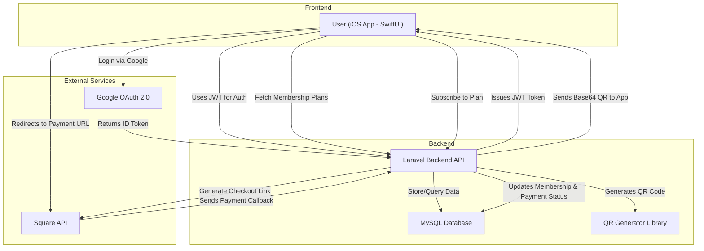

# UTeM : MMSD 5223 - Native Mobile Development II


# 📱 GymMembershipApp (iOS - SwiftUI)

This is the **iOS mobile frontend** for the Gym Membership System. Built using SwiftUI and MVVM architecture, the app integrates with a Laravel backend to allow users to register via Google, subscribe to gym plans, view membership status, and scan QR codes. Square is used for payment processing.

---
## ✅ Features

- 🔐 **Gmail Sign-In** (OAuth 2.0)
- 📲 **JWT-based Authentication**
- 🏋️‍♂️ View and manage **Membership Plans**
- 📆 Subscribe to **1, 3, 6, 12-month packages**
- 📦 Display **QR Code** linked to active membership
- 💳 Handle **Square Payment Integration**
- 📧 Receive **email notifications** after payment
- 🔍 **Search functionality** for plans or user info
- 🌙 **Dark Mode** UI with SwiftUI theming


## 📁 Project Structure

```bash
GymMembershipApp/
├── Models/
│   ├── User.swift
│   ├── Membership.swift
│   └── Plan.swift
├── ViewModels/
│   ├── AuthViewModel.swift
│   ├── MembershipViewModel.swift
│   └── PaymentViewModel.swift
├── Views/
│   ├── LoginView\.swift
│   ├── DashboardView\.swift
│   ├── PlanListView\.swift
│   ├── PaymentView\.swift
│   └── QRCodeView\.swift
├── Services/
│   ├── APIService.swift
│   └── AuthService.swift
├── Resources/
│   └── Assets.xcassets
├── GymMembershipAppApp.swift
└── Info.plist
```


## 🧱 Architecture

The app follows **MVVM (Model-View-ViewModel)** with:

- `ViewModel` using `@Published` and `@StateObject`
- **Networking** layer using `URLSession` for API calls
- **Secure token storage** via `KeychainWrapper` or `UserDefaults`
- Reusable `View` components for QR and payment status

---



---

## 🔑 Authentication

- Uses **Google Sign-In** (via `SignInWithGoogle` package or custom OAuth flow)
- On success:
  - Backend issues a **JWT**
  - JWT is saved in app storage
  - Subsequent requests attach `Authorization: Bearer TOKEN`

---

## 🌐 API Integration

Backend base URL (example):

```swift
let baseURL = "https://your-ngrok-url/api"
````

Sample endpoints:

| Action              | Endpoint                | Method |
| ------------------- | ----------------------- | ------ |
| Google Sign-In      | `/auth/google/redirect` | GET    |
| Fetch membership    | `/memberships`          | GET    |
| List plans          | `/membership-plans`     | GET    |
| Subscribe to a plan | `/subscribe`            | POST   |
| Process payment     | `/payments`             | POST   |

---

## 💳 Payment with Square

* Payment request sent via API
* Payment screen in SwiftUI handles response
* Result stored and displayed with confirmation

---

## 🖼️ Screenshots

> *You can include actual images here once available*

* ✅ Gmail Login
* ✅ Membership Dashboard
* ✅ QR Code Display
* ✅ Plan Selection & Payment
* ✅ Email Notification Preview

---

## 🛠 Requirements

* Xcode 15+
* iOS 15+
* Swift 5+
* Enable **Sign-In with Google** in your Firebase or Google Cloud Console
* Connected Laravel backend (see: [gym-backend](https://github.com/mizannoor/gym-backend))

---

## 📦 Dependencies

* SwiftUI
* Combine
* URLSession
* Square payment (through backend)
* Google Sign-In (OAuth flow)
* QR Code rendering (`CoreImage.CIFilter.qrCodeGenerator`)

---

## 🔒 Security

* JWT stored in secure container
* HTTPS enforced on API calls
* Token refresh logic can be added

---

## 📥 Installation & Setup

1. Clone the repository

```bash
git clone https://github.com/mizannoor/GymMembershipApp.git
```

2. Open `GymMembershipApp.xcodeproj` in Xcode

3. Update backend URL and Google client ID in `Info.plist` or constants file

4. Build and run on iOS Simulator or device

---

## 🪪 License

This project is open-source and available under the [MIT license](LICENSE).


